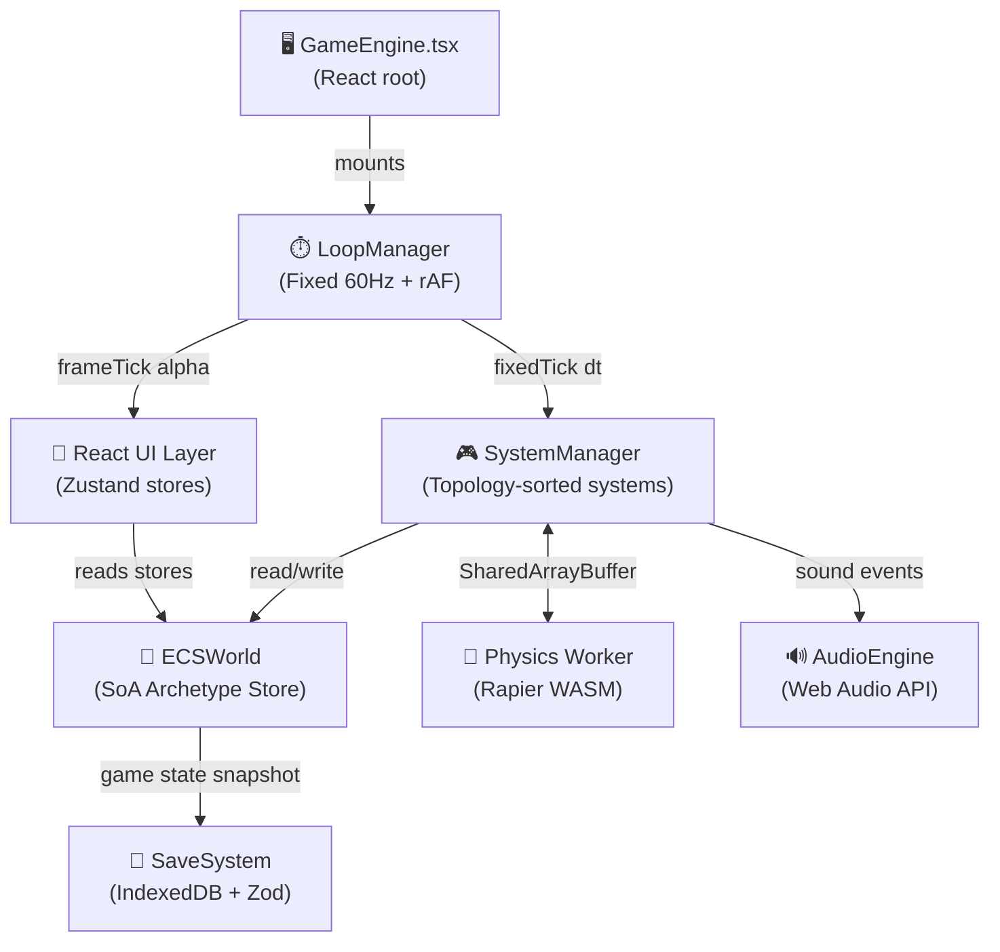

<div align="center">

# 🌆 LIFE — Open World RPG

### *The city lives. You survive.*

[](https://github.com/YOUR_USERNAME/life-rpg/actions/workflows/deploy.yml)
[](package.json)
[](https://www.typescriptlang.org/)
[](https://threejs.org/)
[](LICENSE)

**A browser-based open-world RPG engine built with Three.js, React, Rapier physics, and a custom archetype ECS.**

[▶ Play on GitHub Pages](https://YOUR_USERNAME.github.io/life-rpg) · [📖 Architecture](#architecture) · [🚀 Quick Start](#quick-start) · [🤝 Contributing](#contributing)

</div>

---

## ✨ Features

| System | Status | Description |
|---|---|---|
| 🧩 **ECS Engine** | ✅ Live | Archetype-based, SoA TypedArray, zero-allocation |
| ⚙️ **Physics** | ✅ Live | Rapier WASM — raycast vehicles, ragdolls |
| 🎮 **Player** | ✅ Live | Hierarchical FSM: locomotion · parkour · combat |
| 🔊 **Audio** | ✅ Live | Spatial HRTF, occlusion, vertical music layering |
| 💾 **Save System** | ✅ Live | IndexedDB, signed slots, migration pipeline |
| 📱 **Neo-OS Phone** | ✅ Live | Diegetic UI: Bank · Maps · Music · Camera |
| 🚗 **Vehicles** | ✅ Live | Drift physics, damage model |
| 🕵️ **Stealth** | ✅ Live | Vision/hearing cones, wanted system |
| 🌦️ **Weather** | 🚧 WIP | Dynamic sky, precipitation, volumetric fog |

---

## 🚀 Quick Start

### Prerequisites
- **Node.js** ≥ 20
- **npm** ≥ 10

### Install & Run

```bash
# Clone
git clone https://github.com/YOUR_USERNAME/life-rpg.git
cd life-rpg

# Install dependencies
npm install

# Start development server (http://localhost:5173)
npm run dev
```

### Available Scripts

| Command | Description |
|---|---|
| `npm run dev` | Start Vite dev server with HMR |
| `npm run build` | TypeCheck + Production build |
| `npm run typecheck` | TypeScript check only (no emit) |
| `npm run lint` | ESLint strict check |
| `npm run preview` | Preview production build locally |
| `npm run deploy` | Pre-deploy + full build |

---

## 🏗️ Architecture

### Module Map

```
src/
├── core/                    ← Engine agnostique (aucune dépendance jeu)
│   ├── GameEngine.tsx       ← React root / Three.js canvas bootstrap
│   ├── ECSSetup.ts          ← Archetype ECS, SoA stores, SystemManager
│   ├── LoopManager.ts       ← Fixed-step game loop (60Hz physics + rAF render)
│   ├── WorkerBridge.ts      ← Shared-memory worker communication
│   ├── MemoryPools.ts       ← ObjectPool, TempVec3/Quat, PoolDebugger
│   ├── types.ts             ← Engine-wide types & constants
│   └── index.ts             ← Barrel export (@core)
│
├── features/                ← Feature-first domain layer
│   ├── player/              ← PlayerController + CombatSystem
│   ├── traffic/             ← VehiclePhysics
│   ├── stealth/             ← StealthSensors, wanted-level AI
│   ├── missions/            ← MissionManager, hacking minigame
│   ├── weather/             ← 🚧 Placeholder (types defined)
│   ├── persistence/         ← SaveSystem, Zod schema, migrations
│   └── ui/                  ← Zustand stores, PhoneWrapper, HUD
│
├── audio/                   ← Audio engine (@audio)
│   ├── AudioEngine.ts       ← Spatial HRTF, node graph
│   ├── OcclusionSystem.ts   ← Raycast occlusion, reverb zones
│   ├── MusicController.ts   ← Vertical music layering
│   ├── FoleyManager.ts      ← Procedural footsteps, vehicles, UI SFX
│   └── index.ts             ← Barrel export
│
├── gameplay/                ← Gameplay systems (@gameplay)
│   ├── PlayerController.ts  ← Hierarchical locomotion/combat FSM
│   ├── CombatSystem.ts      ← Weapons, recoil, damage, cover
│   ├── StealthSensors.ts    ← Vision, hearing, light, AI awareness
│   ├── VehiclePhysics.ts    ← Raycast vehicle, drift, damage model
│   └── MissionManager.ts    ← Abstract missions, procedural gen
│
└── ui/                      ← UI layer (@ui)
    ├── store/               ← useUIStore, useSettingsStore, usePhoneStore
    ├── phone/               ← PhoneWrapper + apps (Bank, Maps, Music…)
    ├── hud/                 ← DiegeticHUD, Crosshair, MiniMap, Toast
    ├── settings/            ← SettingsMenu
    └── styles/              ← globals.css (Glassmorphism 2030 theme)
```

### Data Flow



---

## 🔨 Build & Deploy

### Production Build

```bash
npm run build
# Output → dist/
# Chunks: vendor-react | vendor-three | vendor-rapier | vendor-misc | game-core | game-features
# Compression: .br (Brotli) + .gz (Gzip) alongside each chunk
```

### CI/CD — GitHub Actions

Every push to `main` triggers:

1. **TypeScript check** — blocks deploy on any type error
2. **Sitemap generation** → `dist/sitemap.xml`
3. **Vite production build** with chunk splitting + Brotli compression
4. **Deploy** to `gh-pages` branch via `peaceiris/actions-gh-pages`

> **Setup**: Go to your repo → *Settings → Pages → Source: Deploy from branch → `gh-pages`*

### GitHub Pages url variable

In *Settings → Variables → Actions*, add:
```
SITE_URL = https://YOUR_USERNAME.github.io/life-rpg
```

---

## 🤝 Contributing

### How to Add a New Feature

1. **Create the feature folder**:
   ```
   src/features/my-feature/
   ├── index.ts          ← Barrel export
   ├── systems/          ← Pure ECS systems
   ├── components/       ← React components (if any)
   └── hooks/            ← Custom React hooks (if any)
   ```

2. **Register path alias** in `tsconfig.json` and `vite.config.ts` if needed:
   ```json
   // tsconfig.json → paths
   "@features/my-feature/*": ["src/features/my-feature/*"]
   ```

3. **Add a SystemDefinition** and register with `world.systemManager.addSystem()`.

4. **Export from `src/features/my-feature/index.ts`**.

5. **Typecheck** before committing:
   ```bash
   npm run typecheck
   ```

### Code Style

- **No `any`** — explicit types required (`@typescript-eslint/no-explicit-any: error`)
- **Consistent type imports** — use `import type { Foo }` for type-only imports
- **Zero-allocation** in hot paths — use the memory pools in `@core`
- **React Hooks rules** — enforced by ESLint

---

## 🗂️ Tech Stack

| Layer | Technology |
|---|---|
| Rendering | [Three.js](https://threejs.org/) r170 + [@react-three/fiber](https://github.com/pmndrs/react-three-fiber) |
| Physics | [Rapier](https://rapier.rs/) WASM (Dimforge) |
| UI | React 18 + [Framer Motion](https://www.framer-motion.com/) |
| State | [Zustand](https://github.com/pmndrs/zustand) v5 |
| Persistence | [idb-keyval](https://github.com/jakearchibald/idb-keyval) + [Zod](https://zod.dev/) |
| Build | [Vite](https://vitejs.dev/) v6 + TypeScript 5.7 |
| CI/CD | GitHub Actions → GitHub Pages |

---

<div align="center">
<sub>Built with ❤️ — NeoCity never sleeps.</sub>
</div>
